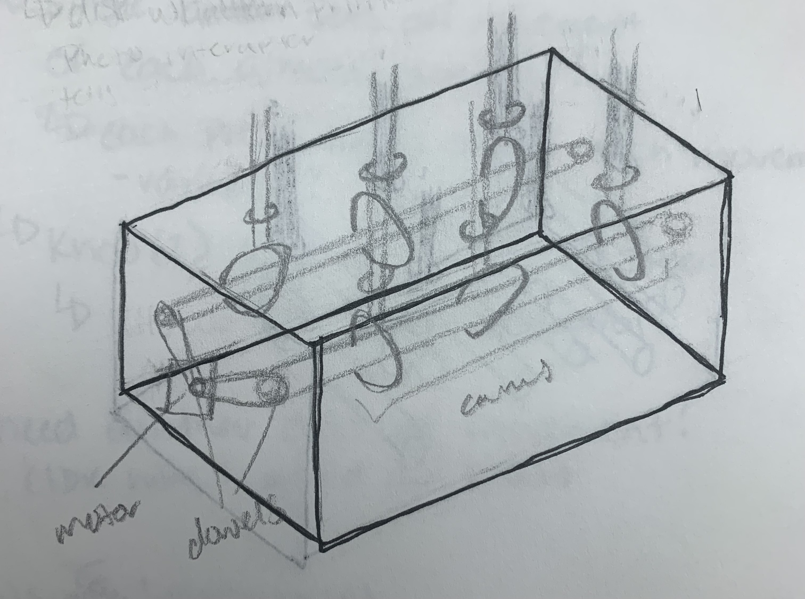

# Final Project Updates

## March 20th

### Final Project Ideas

Create jellyfish (crochet) and either suspend from ceiling or create some sort of stand  
have varying levels of movement based on inputs (buttons, switches, dials, rfid)  
movements: move faster, change direction  

  

Create a solar system (also crochet?)  
inputs (rfid, button, dial, switch) spawn both movement and audio output that bring attention to and facts about different planets  
maybe moves on track?  

  

## April 5th

What if....?  

* able to change speed
* able to set off movement of specific ones (color sets?)
* change direction of movement (noticable?)

6 jellyfish in 3 colors  
3 motors - each connect to 2 jellyfish  
each motor moves for 30 seconds per trigger  
etcentric cams ? pear shaped ?  

  

  

need layers of interaction - 

* toy ?
* unpredictability

buttons start movement of each set

* single button sets off movement of each, almost randomly ?
  * each press turns on/off each movement (variables?)
* knob ? allows control of speed

maybe need another axis of movement (idk how to do that)  

possibly use light switches  
different combinations of switches create different motion (speed, which move, etc)  
