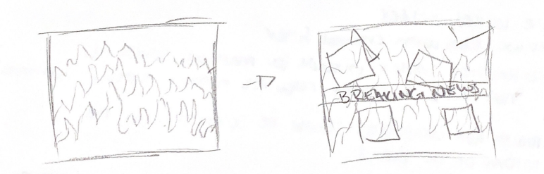

# Midterm Project Sketches/Information

## January 24th Sketches

* Ideas 1 and 1.5

* Ideas 2 and 3

## February 1st Sketches

* Main idea expanded

Mainly thinking that I want to use some sort of puzzle box to create an onscreen image

* knob/dial (built over potentiometer) - brightens background
  * has to stay at a specific input to keep the background not too bright and not too dark
  * once it hits the right input, an led lights
* pressure sensor with blocks or putting jacks in - brings in parts of middle ground
  * each block or jack brings in different parts
  * once all are in, an led lights
* joystick - bring forground into frame
  * an led lights when correctly placed

### Other details

* must be done in order
* maybe wrong order lights led a different color
  * green - success
  * red - wrong

## February 15th Update

Working with Grace on the rocking horse affecting on screen projection  
Using phone accelerometer to register changes of horse position

Rocking triggers the fire animation to play  
The amount of rocking triggers various overlays

* adding chaos on screen of video clips, images, news stills, warnings
  * speeding up causes more overlays
  * slowing down causes less overlays
* after a period of stillness, the projection resets
  * allows for individual interactions

