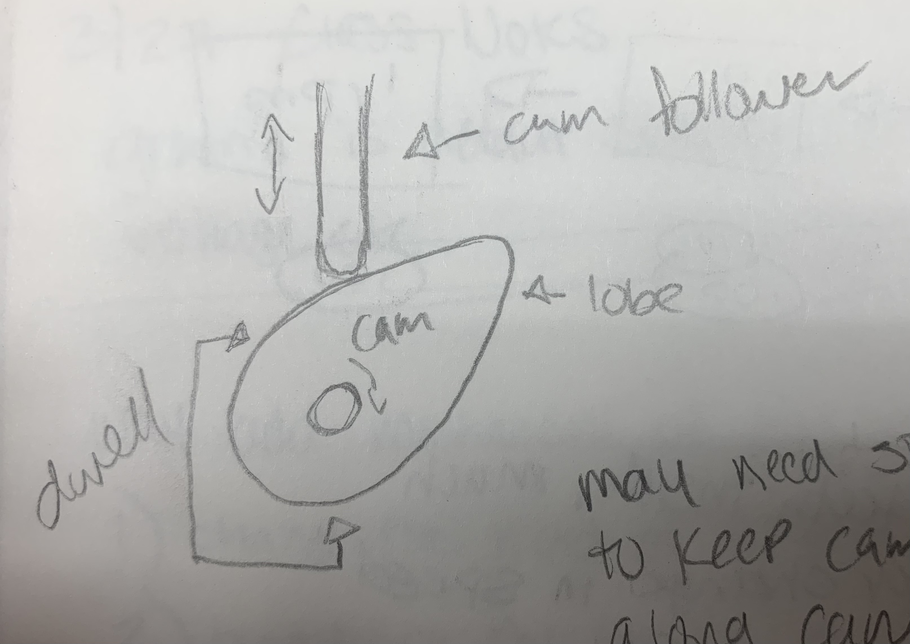
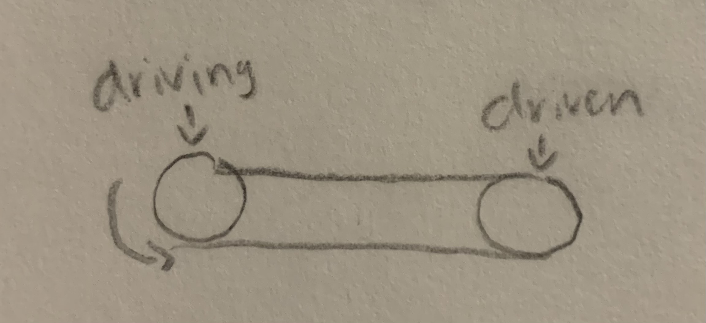
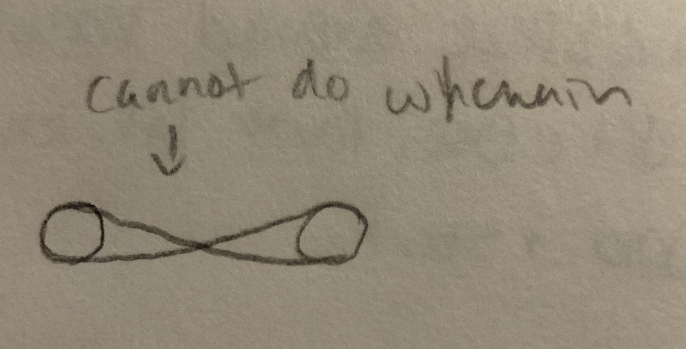
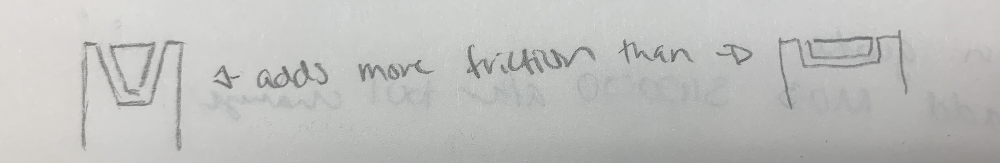
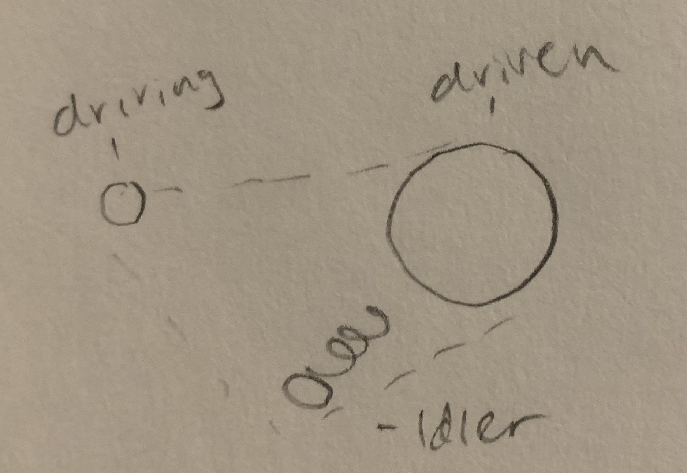
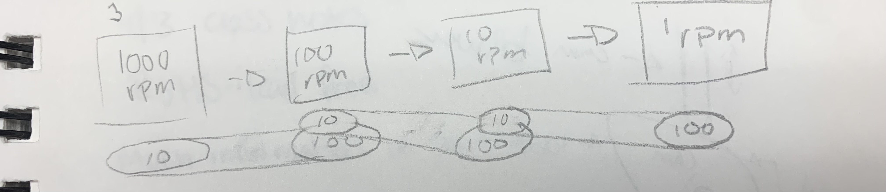

# Week 12 Notes

## March 27th Class Notes

Ground is default starting point for measuring voltage, etc.  

Why add mechanisms of our own?

1. Change the kind of motion
2. Translating the location of movement
3. Change the speed/power of the motor
   1. slower = stronger, faster = weaker

6 Simple Machines

* Wheels and axles
* Lever
  * multiple classes
* Inclined plane
* Pulley
* Screw
* Wedge
  * basically an inclined plane

Changing the kind of motion:  
Making Things Move - Dustyn Roberts  
[Cabaret Mechanical Movement](https://www.cs.cmu.edu/afs/cs/academic/class/15394t-s17/resources/cabaret_mechanical_movement.pdf)  
[Contemporary Automata](http://www.contemporaryautomata.com/)  
  
Cam follow may need a spring or other method to keep it riding along the cam

Translating the location of movement:  
Direct Drive- gears and chains  
Friction Drive - pulleys and belts  
  
  
  
  

Changing the speed/power of a motor:  
  
planetary gear- has teeth inside, much greater change in speed  
spur gear- traditional gear, has teeth outside  
gear ratio  
Fly Wheel- creates momentum, smooths out movemet, large/heavy gear and pulley  

## March 29th Class Notes

No Class
