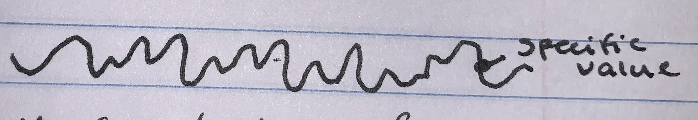

# Week 2 Notes

## January 17th Homework Notes

### Basics of Electricity

Two Types of Electricity:

AC: alternating current

* voltage goes positive and negative
* meaured in volts (V)
* cycles per second mearues in hertz (Hz)
* power out of a wall socket/outlet
  * Standard US outlet: 110V 60Hz
  * Standard UK outlet: 220V 50Hz

DC: direct current

* constant voltage
* measures votage between positive and negative
  * negative = 0V
  * positive = voltage of current
* batteries

Ohm's Law: V = I x R (volts = current x resistance)

Power Triangle: P / I x E  (power(watts) / resistance x volts)

Multimeter can meaure volts, current and resistance

### How a Breadboard Works

* Allows wires to connect while avoiding soldering
* Numbered rows are connected underneath whitin ron, not between rows
  * trough in the center of board disconnects the two sides
* positive and negative colluns are conneced unerneath within the column, but not across
  * sometimes disconnected halfway down board, depending on size

### Flashlight Circut

Components:

* LED light
* fixed restrictors
  * have specific ohms
* blue nob for variable resistance
  * 0-10k ohms

When connceting positive battery, always connect last to avoid short circuting the board

### Schematics and Diagrams

Has various symbols for each part

### Components in a Flashlight Circut

LED

* Needs to be oriented positive/negative correctly
  * inside LED bulb-
    * larger wire filament = negative
    * smaller wire filament = positive
  * on rim of LED bulb casing- flattened edge = negative
  * short leg of wire = negative
  * long leg of wire = positive

Resistor

* non polarized - does not have positive/negative ends
* gold stripe = 5% resistance
* 3 colored striped tell ohms
  * first stripe - first number
  * second stripe - second number
  * third stripe - number of zeros
  * colors -
    * black = 0
    * brown = 1
    * red = 2
    * orange = 3
    * yellow = 4
    * green = 5
    * blue = 6
    * violet = 7
    * gray = 8
    * white = 9
  * examples
    * 10k ohms= brown/black/orange
    * 10 ohms = brown/black/black
    * 330 ohms = orange/orange/brown
    * 1.5k ohms = brown/green/red

### Lab 1

Too many volts can burn out a compontent

* Volts = pushing
* Amps = drawing

### Lab 2

Voltage divider = resistors on group and volt end to change coltage recieved

Multimeter

* can measure
  * DC Voltage (DCV)
  * AC Voltage (ACV)
  * DC Amps (DCA)
  * Resistance
* com = minus (negative) input
* put dial at next highest number than the voltage
  * allows most accuracy

Patentiameter = variable ohms nob

Vout = Vin x (R2 / R1 + R2)

## January 18th Class Notes

IDE = Intergrade Development Environment

Platform.IO - includes a library for Arduino (requires "include arduino.h" command)

Micro controller board - Arduino UNO

* microcontroller
* crystal
* power port
* varios pins
* Works on 5v
* others work on 3.3v
* most electronics work on 3.3v

GPIO = General Purpose Input and Output

Digital Vs Analog

* digital

  * either off or on, binary
  * examples
    * lamp
    * cd
    * files
    * computer
* analog

  * continuous, non-binary
  * voltage vaule is what we are looking for
  * examples
    * dimmer
    * vinyl record
    * wax cylinder
* DAC = digital to analog converter
* ADC = analog to digital converter
* PWM = pulse with modulation (form of DAC)

Input Examples

* Sound (mic)
* Light (sensor)
* Movement (sensor)
* Switch
* Temperature (sensor)

Output Examples

* Speaker
* Motoer
* LED/light
* LED Display
* Relay

.cpp extension = c++ file

void setup(){} = code run once

void loop(){} = code run repeatedly

* not based on cycles per amount of time, but the amount of time it takes to complete all lines in code

put pin input/output modes in setup

* pinMode(pin#,mode)

turn light on

* digitalWrite(pin#,value[high/low])
* delay(ms)
  * need delay in order to have light stay on or off
