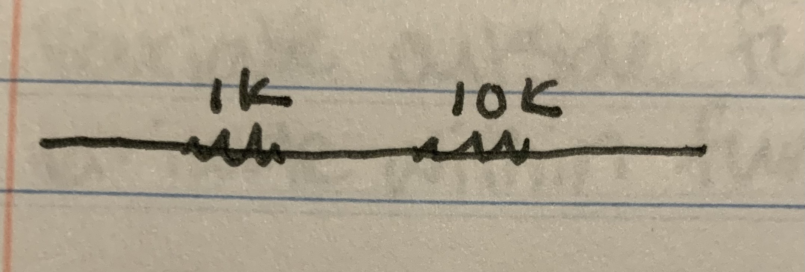
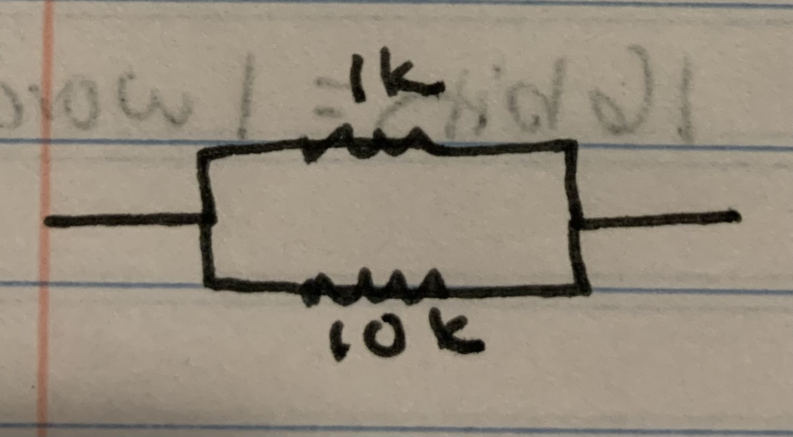
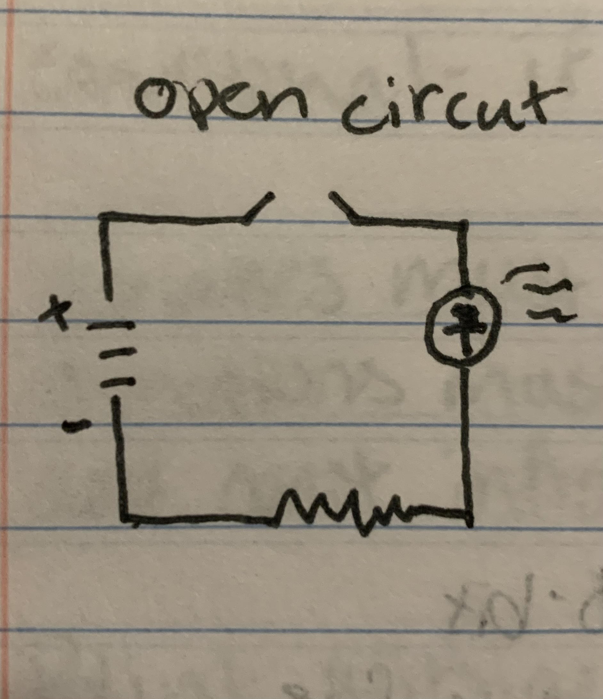
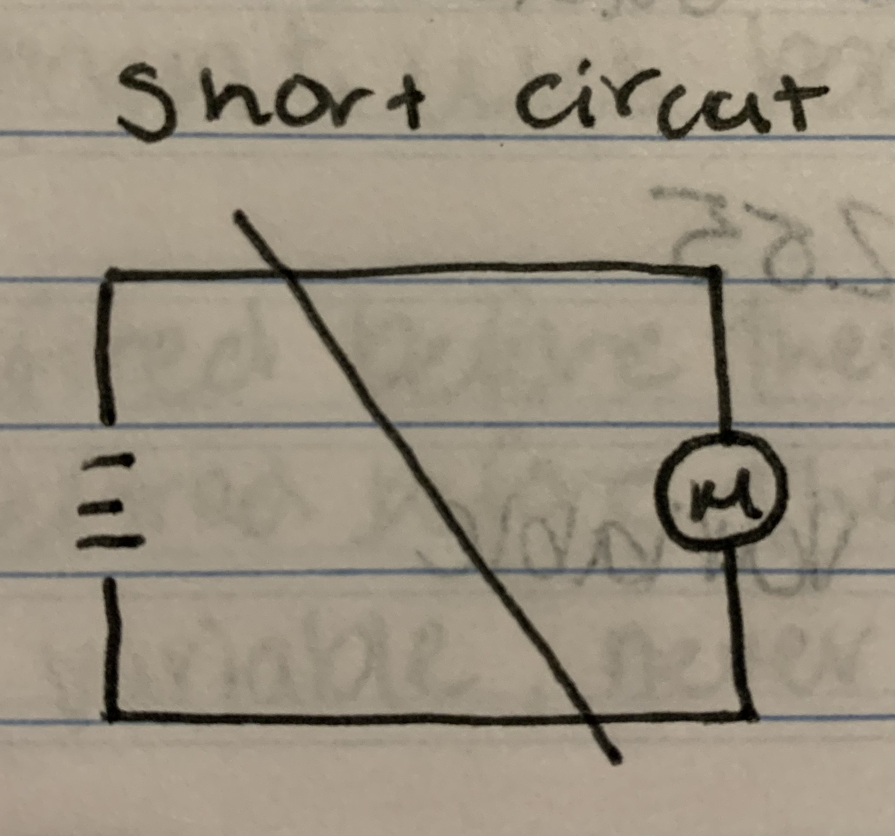
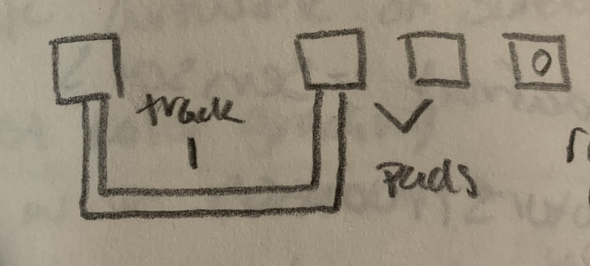

# Week 3 Notes

## January 20th Lab Notes

First try- LED came on with button, would not turn off

* resaved and uploaded code, no change
* did noting, waited and tried button again and it worked
  * guess - loose wiring connection that was fixed accidentally

Off button stopped working again

* seems to only work after waiting a few seconds after turning on.

Took out wiring connected to off button and rewired it

* now works, seems like the tension on the wire was causing it to pop out

## January 23rd Class Notes

wiring in series - putting components in a single, unbroken chain

*  = 11k resistance

wiring in parallel - putting compontents in two chains that connect into one chain on either end

*  = a bit more than 1k resistance

Short Circut - when comething is connecting the positive and negative battery terminal. causes current to rush out and voltage to drop

delay in programming prevents other inputs from being read

pin 13 - onboard LED  
pin 1 - tx  
pin 0 - rx  
pins with ~ - PWM

### Coding

#### **Storing Data**

letters translate to numbers in ASCII

bit - 1/0, binary-base 2

Conversions:

* 4 bits = 1 nibble
* 8 bits = 1 byte
* 16 bits = 1 word
* 32 bits = 1 long
* 64 bits = 1 double long

byte's data range is 0 - 255

data is stored in a variable

**data types:**

8-bit:

* **bool** - boolean data, true or false
* **byte** - unsigned (not positive or negative), range 0-255
* char - signed (has positive or negative), range -127-127

16-bit:

* word - unsigned, range 0-65k
* **int** - intager, signed, range -32k-32k

32-bit:

* **unsigned long** -good for storing time, range 0-4m
* float - contains decimals, arduinos cannot understand

chip can do addition, subtraction and multiplication

* division must be done in software

in code variables - type name value(optional, default 0)

* example: byte sensorVal = 0;

void - function that does not return anything

#### **Variable Scope**

global scope - variable outside of a function, can be used in any function  
local scope - variable within a function, can only be used within the function it is defined in

boolean expression:

* either true or fales
* used in if then else statements
* can be multiple expressions
* && is and, both expressions must be true, otherwise whole statement is false
* || is or, either expression can be true to make statement true, both must be false or statement is true

conditional statement - if statement, uses boolean expressions

variables must be defined before they are used  
functions must be defined before they are used  
add const in front of variable, makes variable never changing

#### **Blink without Delay**

check to see if 1 second has passed since last blink

* if true, blink again
  * make note of new last blink

unsinged long previousTimeStamp = 0;

int ledState = LOW;

long interval = 1000;

void loop() {

    unsigned long currentTimeStamp = millis();

    if (currentTimeStamp - previousTimeStamp >= interval) {
        if (ledstate == LOW) {
            ledstate = HIGH;
        } else {
            ledstate = LOW;
        }
        previousTimeStamp = currentTimeStamp;
    }
    digitalWrite(LED_BUILTIN,ledstate);
}

## January 25th Class Notes

Serial Communication:

* syncronous - I2C, SPI, 1-Wire
* asyncronous - RS232

serial monitor - shows data coming from micro controller

ReacTable

sparkfun/adafruit - sensors  
pololu/hobby town usa - motors/robotics  
FFT - Fast Fourier Transform, filters out certain frequencies  
Load Cell - determines weight, needs an amplifier

### Soldering

#### **Circut Board Components**

* Surface Mount - SMD, solders to the top of the board
* Through Hole - TH/PTH, legs poke through board and are soldered to the bottom
* Traces/Tracks - copper on plate connecting components
  * engrave or etch away copper to create tracks
* solder mask - only allows solder to connect to copper
* pad - where copper tracks end, where components are soldered
* plated hole - copper lined holes for PTH compontents, connect top and bottom pads

* refdes - reference designator
* types of boards
  * FR1 - paper based boards, what we use
  * FR2 - fiberglass based boards
* silk screen - white markings on board labeling areas
* via - plated hole from top to bottom

boards are layered - copper / paper or fiberglass / copper

* copper layers are extremely thin

pot - potentiometer

#### **Soldering process**

each solder has a specific heating curve  
thickness of wires are measured in guage

* the smaller the number, the thinner the wire

Solid vs Stranded wire

* solid stays bent, while stranded will unbend
* solid will bend to break, stranded can be bent and unbent
* solid is a single wire, stranded is individual twisted wires
* solid can withstand higher current than same guage stranded

tinning - coating stranded wire in solder to allow for use in breadboard

Temps:

* 325c for soldering smaller components
* 350c for soldering wires and larger components

we use leaded solder, make sure to be careful of fumes  
put a blob of solder on the tip of the wand to help transfer heat  
put heat shrink tubing on wire before soldering wires together

* make sure it is far enough away that the heat of the wand does not shrink the tubing
