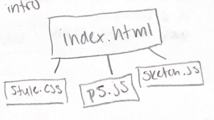
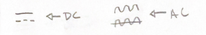
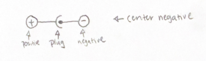

# Week 5 Notes

## February 6th Class Notes

Markdown Table Pretifier - VSC Extension, auto formats tables to make easier to read
Putting a Video in Markdown -

* link to video site
* short videos made into animated gif
* WedM - video file playable in HTML < video > tag

### VS Code

* Build clean essentially cleard build queue
* Ctrl + Alt + P - search panel for all commands
* Can add parenthesis to math equation to make equation easier to read and make sure it is done in the correct order
* When building, terminal tells percentage of storage code uses on chip

### P5JS Intro

In Sketch:

* setup runs once when page loads
* draw runs as many times per second as possible
  * usually 60 times per second
* console.log (variable) - prints variable in console of browser
  * access console with Ctrl + Shft + J

### Hooking P5JS To Arduino

#### Files

* add library p5.webserial.js
* add serialfunctions.js
  * all code can be in js
  * seperate files make it easier to read

#### Other Notes

* inData - incoming data as a number (variable)
* P5JS Webserial template available on github
  * [Github Template](https://github.com/FSUdigitalmedia/p5js_webserial_template)
* if you have multiple incomming data, use an array
* incomingSerialData[#] - number in list of target data array
* [Examples of P5JS](https://showcase.p5js.org/#/)

Makey Makey - an aurdiono that can pretend it is a keyboard

* uses compatible touch

## February 7th Sensor Changes Lab Notes

Joystick - two potentiometers for x and y axis and a pushbutton switch

### Connecting Joystick to Arduino

| Joystick        | Arduino                     |
|-----------------|-----------------------------|
| 5v on joystick  | 5v on arduino               |
| GND on joystick | GND on arduino              |
| VRx on joystick | analog input A0 on arduino  |
| VRy on joystick | anaolog input A1 on arduino |
| SW on joystick  | digital input 3 on arduino  |

VRx - variable resistor, x-axis
VRy - variable resistory, y-axis
input_pullup - prevents the pin from floating and giving inconsitent high/low readings

## February 8th Class Notes

On circut board -  Q = transistor
stages- grouped components on a circut board that are related
our resistors are 1/4 watt
capacitors store charge
ac syncronous motor - microwaves

* uses ac power, can be plugged into wall
* dc moters will move opposite direction of leads are switched

continuity multi meter function - finds ground
input_pullup - adds resistor to prevent short in flating switch
debounce button - use software

surpluscenter.com - where we can buy larger components
VIN and GND pin on arduino do not go throught the voltage regulator

### Power Supply Notations

On wall Plugs:

* *DC* out - how many volts? (#V) and what current can it supply (#A or #mA)
  * 
* type of plug charge
  * 
  * 
* **switching power supply** - turning on and off very quickly, regulated, has electronics, is also called a chopper
* Linear power supply - non-regulated, puts our more voltage than labeled, assmuming that the voltage will change depending on what is plugged in, only has transformer (no other electronics)