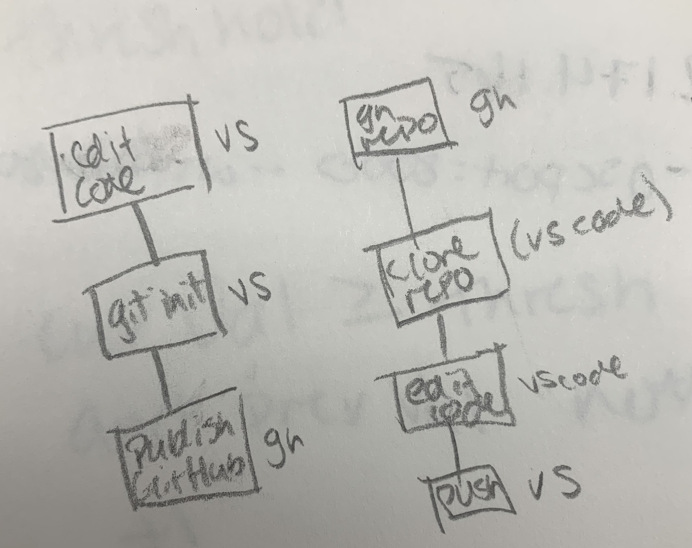
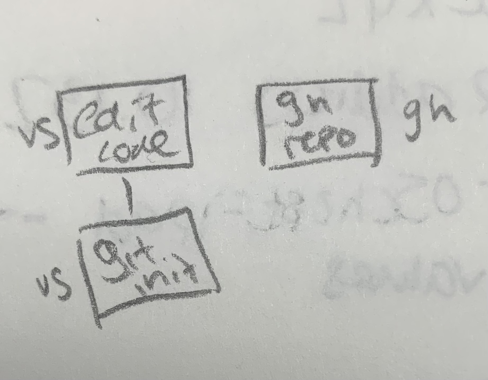

# Week 8 Notes

## February 27th Class Notes

Open CV

* Computer Vision
* Can detect in varying degrees motion/the number of people in a room

github is origin remote  
vscode is local remote  

  

## March 1st Class Notes

Meet @ CAB next Wednesday  

Using various thresholds to do different things (points)  
oscxyz  
ipaddress 10.132.174.165  
--oschost=ipadd --oscport=8000 --wsport=8080 --values  
we want y value  

[FSU Digital Media](https://github.com/FSUDigitalMedia)  
[P5 Keeper Tracker](https://github.com/FSUDigitalMedia) ignore (not useful)  

past value  
current value  
threshold >=  
curVal >= thresh  
and prevVal not  
+1  
